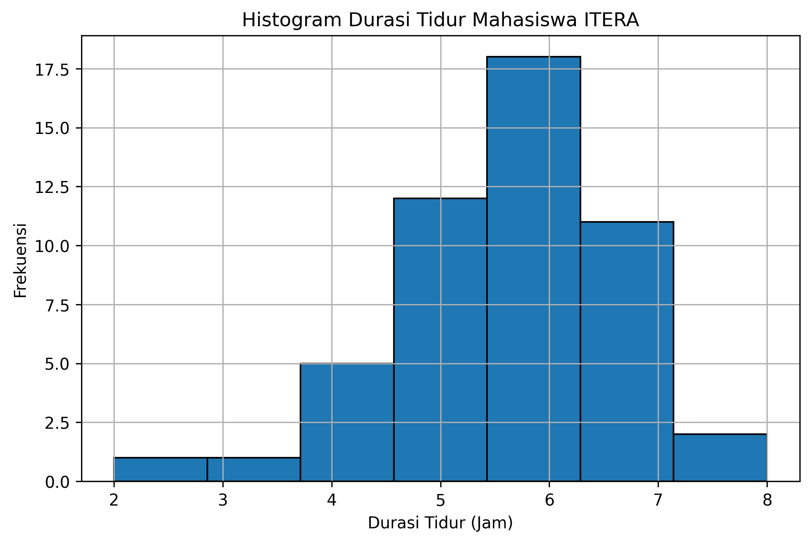
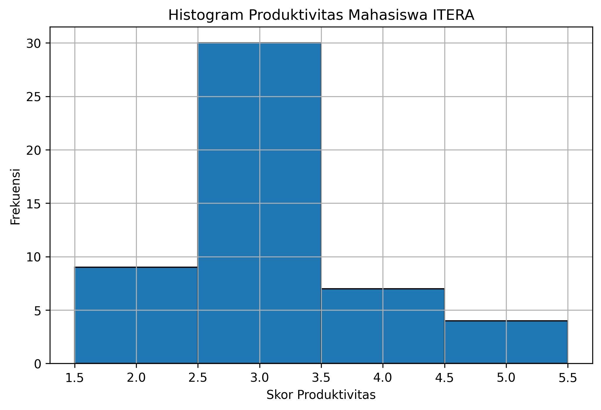
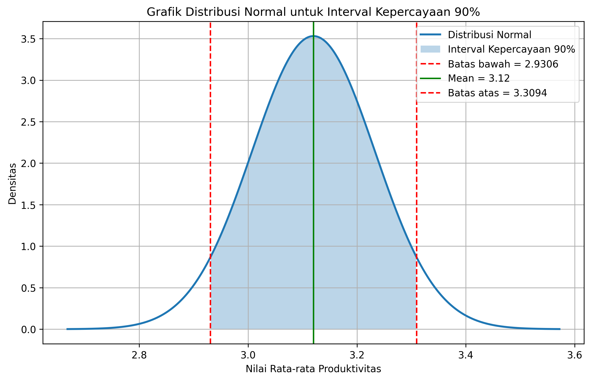
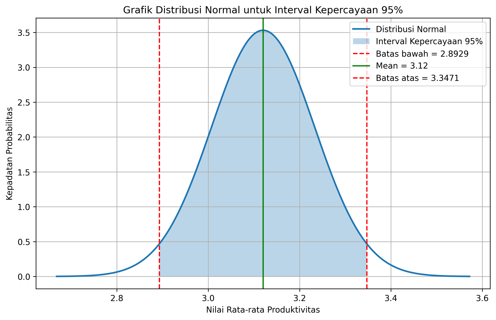
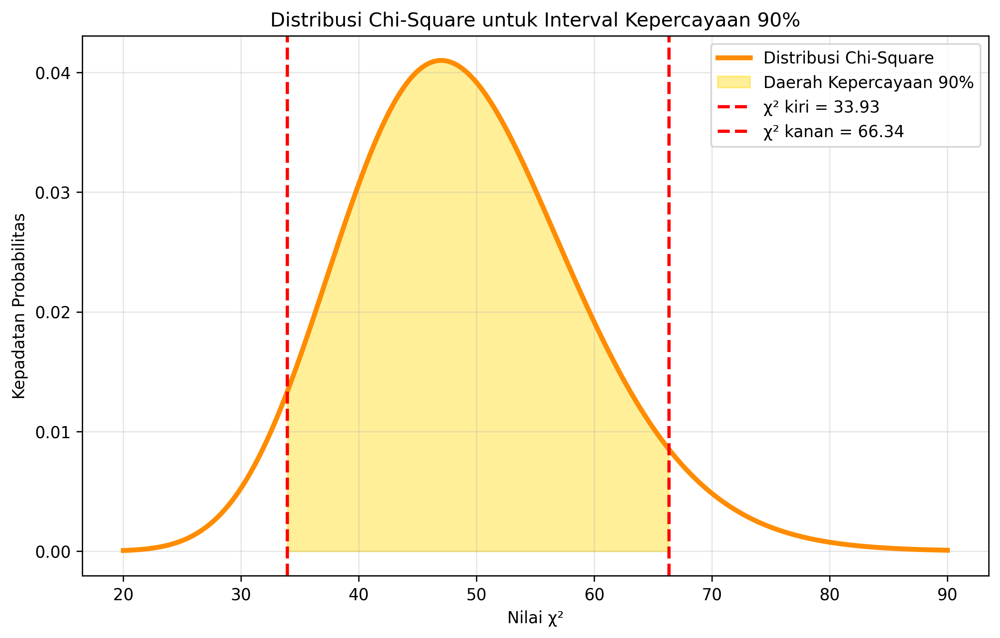
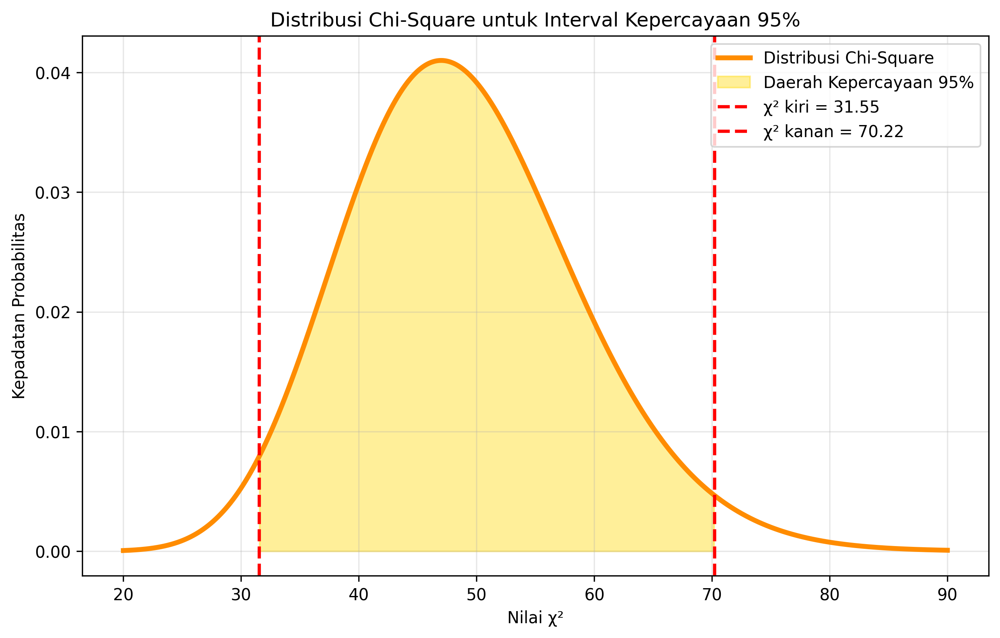
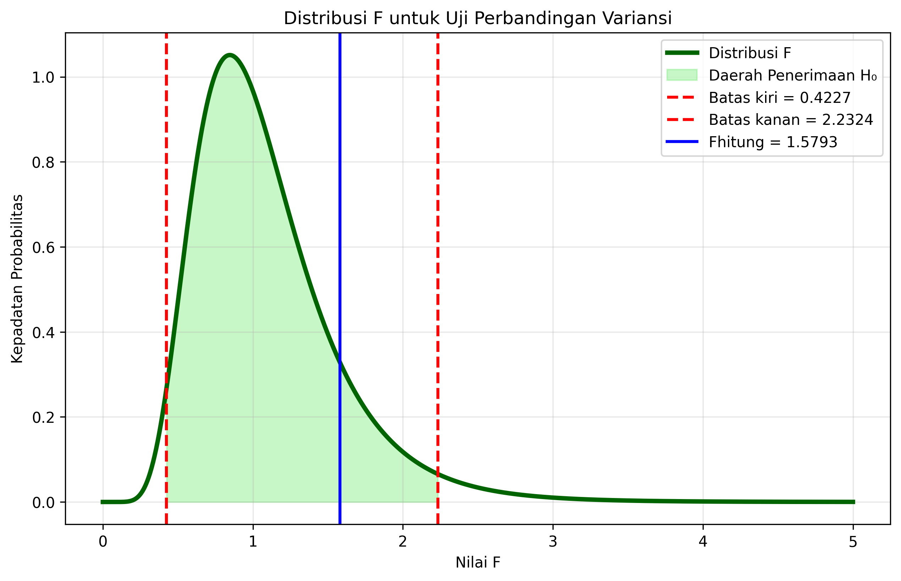

# TUBES_PROBSTAT

## Visualisasi yang Dibuat

### 1. Histogram Durasi Tidur

Visualisasi distribusi durasi tidur responden.

### 2. Histogram Produktivitas

Visualisasi distribusi tingkat produktivitas responden.

### 3. Distribusi Normal Interval Kepercayaan 90%

Visualisasi interval kepercayaan 90% untuk rata-rata produktivitas.

### 4. Distribusi Normal Interval Kepercayaan 95%

Visualisasi interval kepercayaan 95% untuk rata-rata produktivitas.

### 5. Distribusi Chi-Square Interval Kepercayaan 90%

Visualisasi interval kepercayaan 90% untuk variansi populasi.

### 6. Distribusi Chi-Square Interval Kepercayaan 95%

Visualisasi interval kepercayaan 95% untuk variansi populasi.

### 7. Distribusi F

Visualisasi uji perbandingan variansi menggunakan distribusi F.

---

## Teknologi yang Digunakan

* Python 3.13
* NumPy
* Matplotlib
* SciPy

Tugas Besar Probabilitas dan Statistika
Institut Teknologi Sumatera (ITERA)
